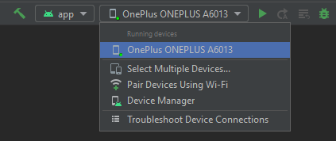

# BOB
Diese App ist ein Prototyp für **BOB** (Bahnfahren ohne Belästigung). Es handelt sich hierbei um ein System, welches Opfern von Belästigung im ÖPNV ermöglicht, sich schnell Hilfe zu holen. Der Prototyp wurde vorerst nur für Android optimiert.

 

## ANDROID SETUP
Um die App auf einem Android-Gerät zum Laufen zu bringen, bitte folgende Schritte befolgen:

1. Repository klonen

2. Android Studio installieren (z.B. Wie das geht, steht <a href="https://developer.android.com/studio/install">hier</a>.)

3. Im root-Ordner des Projekts das Terminal öffnen

4. Alle erforderlichen Packages installieren mit `npm install`

5. Die Android-App mit `npx ionic cap sync` fertigstellen

6. Die App in Android Studio mit `npx ionic cap open android` öffnen (oder in Android Studio über File -> Open den "android"-Ordner im Projektordner auswählen)

7. Ein Android Handy per USB mit dem PC verbinden und in Android Studio auswählen  

8. App ausführen mit dem "Run"-Button in Android Studio  

 
 

## WEB SETUP
1. Repository klonen

2. Im root-Ordner des Projekts das Terminal öffnen

3. Alle erforderlichen Packages installieren mit `npm install`

4. Web-App starten mit `npm start`

(**Wichtig:** Die Anwendung verfügt in der Browser-Version nicht über alle wichtigen Funktionen. Sie dient ausschließlich zum Testen und Entwickeln.)